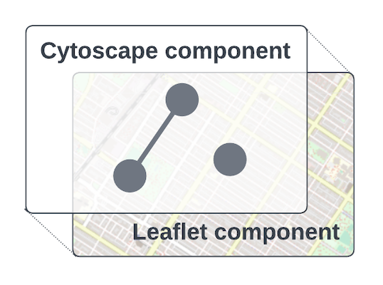
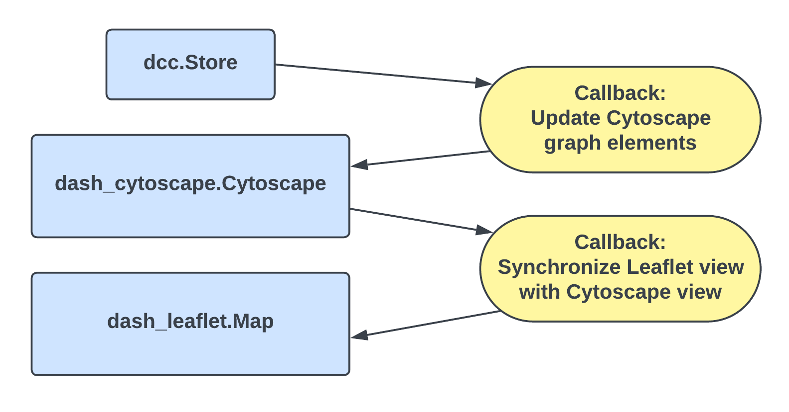

# CyLeaflet: Cytoscape graph component with map layer

CyLeaflet is a Dash component included with Dash Cytoscape which adds geospatial mapping layer to Cytoscape. Node latitude and longitude are specified in the node data, and then rendered by CyLeaflet in the correct position on the map. See the [CyLeaflet documentation](https://dash.plotly.com/cytoscape/cyleaflet) for full usage information.

 This document describes the architecture of the CyLeaflet component.

## Component structure

CyLeaflet uses the Dash [All-in-One Component](https://dash.plotly.com/all-in-one-components) pattern to combine Dash Cytoscape and Dash Leaflet with minimal overhead.

This means that CyLeaflet appears at first glance to be a first-class Dash component, but is actually multiple Dash components in a trenchcoat.

Under the hood, an instance of CyLeaflet consists of:

1. A Dash Cytoscape instance
2. A Dash Leaflet instance
3. A dcc.Store instance used for holding element data (explained in more detail below)
4. Some surrounding html.Divs which apply the necessary styling to align the Cytoscape canvas exactly on top of the Leaflet canvas.
5. Several clientside callbacks to link the individual components together

## Files

CyLeaflet functionality is implemented in the following files:

1. `dash_cytoscape/CyLeaflet.py`: CyLeaflet class definition, instantiation of underlying Cytoscape and Leaflet components, layout and styling to align the two canvases, and registration of clientside callbacks
2. `src/lib/cyleaflet_clientside.js`: Clientside callback function implementations

## Callbacks

The following callbacks are used by CyLeaflet:

- **Synchronize Leaflet view with Cytoscape view**
  - Input: Cytoscape `extent` property
  - Outputs: Leaflet `viewport` property, Leaflet `invalidateSize` property
  
  Purpose: Ensures that the nodes remain in the same places on the map whenever the view is zoomed or dragged. Whenever the Cytoscape view changes, this callback updates the Leaflet view to match. An additional output, the Leaflet  `invalidateSize` property, ensures the map gets refreshed properly.

- **Update Cytoscape graph elements**
  - Input: dcc.Store `data` property
  - Output: Cytoscape `elements` property
  
  Purpose: Provides a way for the Dash developer to update the graph elements displayed in Cytoscape. This callback transforms the `lat` and `lon` coordinates specified in the node data into a corresponding (x, y) canvas position that will align with the map. Updating the Cytoscape nodes directly does not work, because this skips the transformation step, and the nodes will not appear in the correct map positions. 