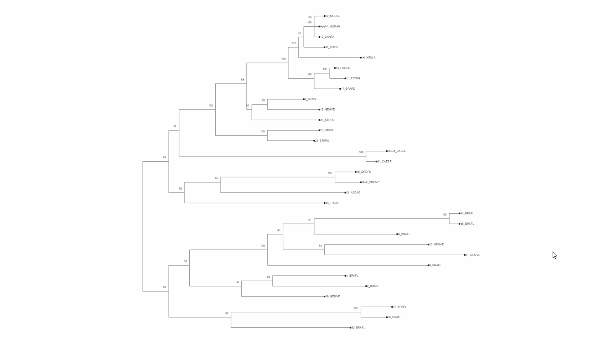
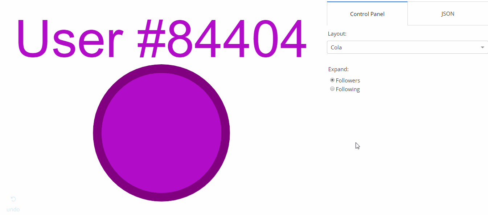

# Dash Cytoscape [](https://github.com/plotly/dash-cytoscape/blob/master/LICENSE) [](https://pypi.org/project/dash-cytoscape/)

<div align="center">
  <a href="https://dash.plotly.com/project-maintenance">
    
  </a>
</div>


[](https://circleci.com/gh/plotly/dash-cytoscape)

A Dash component library for creating interactive and customizable networks in Python, wrapped around [Cytoscape.js](http://js.cytoscape.org/).


-   🌟 [Medium Article](https://medium.com/@plotlygraphs/introducing-dash-cytoscape-ce96cac824e4)
-   📣 [Community Announcement](https://community.plotly.com/t/announcing-dash-cytoscape/19095)
-   💻 [Github Repository](https://github.com/plotly/dash-cytoscape)
-   📚 [User Guide](https://dash.plotly.com/cytoscape)
-   🗺 [Component Reference](https://dash.plotly.com/cytoscape/reference)
-   📺 [Webinar Recording](https://www.youtube.com/watch?v=snXcIsCMQgk)

## Getting Started in Python

### Prerequisites

Make sure that dash and its dependent libraries are correctly installed:

```commandline
pip install dash
```

If you want to install the latest versions, check out the [Dash docs on installation](https://dash.plotly.com/installation).

### Usage

Install the library using `pip`:

```
pip install dash-cytoscape
```

If you wish to use the CyLeaflet mapping extension, you must install the optional `leaflet` dependencies:

```
pip install dash-cytoscape[leaflet]
```

Create the following example inside an `app.py` file:

```python
import dash
import dash_cytoscape as cyto
from dash import html

app = dash.Dash(__name__)
app.layout = html.Div([
    cyto.Cytoscape(
        id='cytoscape',
        elements=[
            {'data': {'id': 'one', 'label': 'Node 1'}, 'position': {'x': 50, 'y': 50}},
            {'data': {'id': 'two', 'label': 'Node 2'}, 'position': {'x': 200, 'y': 200}},
            {'data': {'source': 'one', 'target': 'two','label': 'Node 1 to 2'}}
        ],
        layout={'name': 'preset'}
    )
])

if __name__ == '__main__':
    app.run(debug=True)
```


### External layouts

You can also add external layouts. Use the `cyto.load_extra_layouts()` function to get started:

```python
import dash
import dash_cytoscape as cyto
from dash import html

cyto.load_extra_layouts()

app = dash.Dash(__name__)
app.layout = html.Div([
    cyto.Cytoscape(...)
])
```

Calling `cyto.load_extra_layouts()` also enables generating SVG images.

## Getting Started in R

### Prerequisites

```R
install.packages(c("devtools", "dash"))
```

### Usage

Install the library using devtools:

```
devtools::install_github("plotly/dash-cytoscape")
```

Create the following example inside an `app.R` file:

```R
library(dash)
library(dashHtmlComponents)
library(dashCytoscape)

app <- Dash$new()

app$layout(
  htmlDiv(
    list(
      cytoCytoscape(
        id = 'cytoscape-two-nodes',
        layout = list('name' = 'preset'),
        style = list('width' = '100%', 'height' = '400px'),
        elements = list(
          list('data' = list('id' = 'one', 'label' = 'Node 1'), 'position' = list('x' = 75, 'y' = 75)),
          list('data' = list('id' = 'two', 'label' = 'Node 2'), 'position' = list('x' = 200, 'y' = 200)),
          list('data' = list('source' = 'one', 'target' = 'two'))
        )
      )
    )
  )
)

app$run_server()
```

## Documentation

The [Dash Cytoscape User Guide](https://dash.plotly.com/cytoscape/) contains everything you need to know about the library. It contains useful examples, functioning code, and is fully interactive. You can also use the [component reference](https://dash.plotly.com/cytoscape/reference/) for a complete and concise specification of the API.

To learn more about the core Dash components and how to use callbacks, view the [Dash documentation](https://dash.plotly.com/).

For supplementary information about the underlying Javascript API, view the [Cytoscape.js documentation](http://js.cytoscape.org/).

## Contributing

Make sure that you have read and understood our [code of conduct](CODE_OF_CONDUCT.md), then head over to [CONTRIBUTING](CONTRIBUTING.md) to get started.

### Testing

Instructions on how to run [tests](CONTRIBUTING.md#tests) are given in [CONTRIBUTING.md](CONTRIBUTING.md).

## License

Dash, Cytoscape.js and Dash Cytoscape are licensed under MIT. Please view [LICENSE](LICENSE) for more details.

## Contact and Support

See https://plotly.com/dash/support for ways to get in touch.

## Acknowledgments

Huge thanks to the Cytoscape Consortium and the Cytoscape.js team for their contribution in making such a complete API for creating interactive networks. This library would not have been possible without their massive work!

The Pull Request and Issue Templates were inspired from the
[scikit-learn project](https://github.com/scikit-learn/scikit-learn).

## Gallery

### Dynamically expand elements

[Code](usage-elements.py) | [Demo](https://dash-gallery.plotly.host/cytoscape-elements)


### Interactively update stylesheet

[Code](usage-stylesheet.py) | [Demo](https://dash-gallery.plotly.host/cytoscape-stylesheet)


### Automatically generate interactive phylogeny trees

[Code](demos/usage-phylogeny.py) | [Demo](https://dash-gallery.plotly.host/cytoscape-phylogeny/)


### Create your own stylesheet

[Code](usage-advanced.py) | [Demo](https://dash-gallery.plotly.host/cytoscape-advanced)


### Use event callbacks

[Code](usage-events.py) | [Demo](https://dash-gallery.plotly.host/cytoscape-events)


### Use external layouts

[Code](demos/usage-elements-extra.py)


### Use export graph as image

[Code](demos/usage-image-export.py)


### Make graph responsive

[Code](demos/usage-responsive-graph.py)


For an extended gallery, visit the [demos' readme](demos/README.md).
