# Additional Demos

The following demos were created in addition to the existing usage files:
* Phylogeny

## Requirements

The examples here use the PyPi release of dash-cytoscape currently installed, rather than the latest development version. If you wish to use the latter, please move your demo (and its associated data files) into the parent folder, and run from there.

To run `usage-phylogeny.py`, you need to install biopython:
```commandline
$ pip install biopython 
```

## Gallery

#### usage-circle-layout
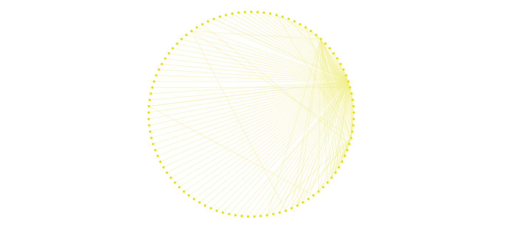

#### usage-concentric-social-network
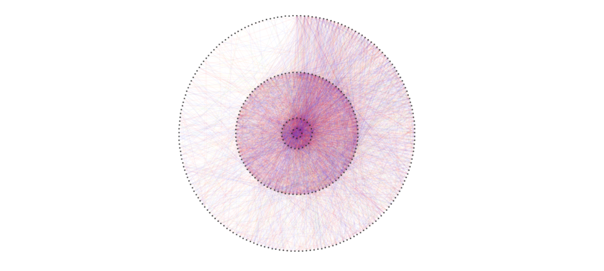

#### usage-dag-edges
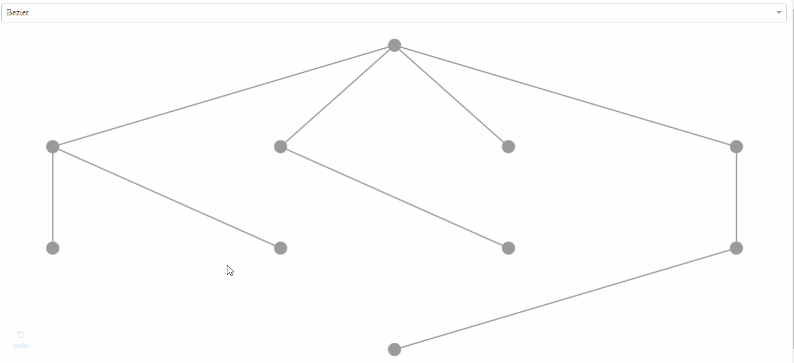

#### usage-elements-extra
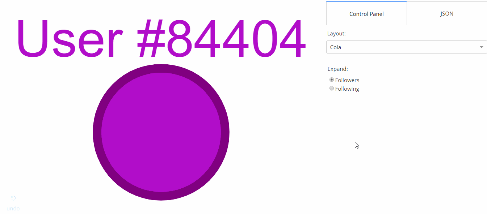

#### usage-grid-layout
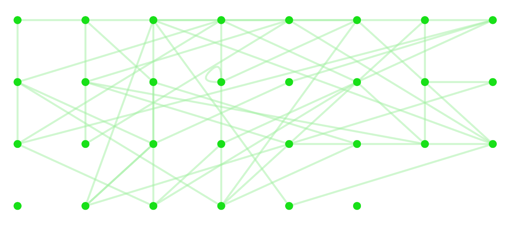

#### usage-grid-social-network
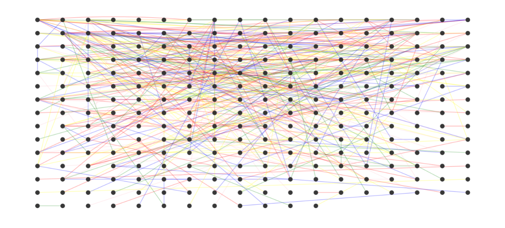

#### usage-phylogeny
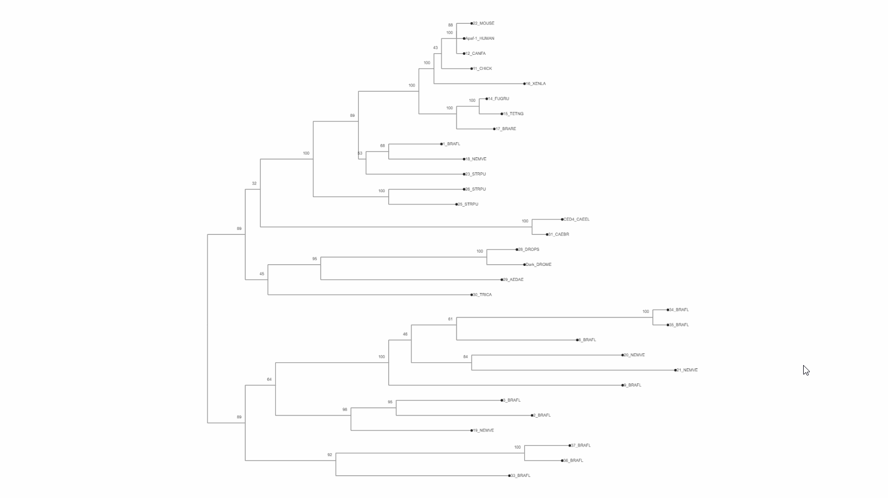

#### usage-pie-style
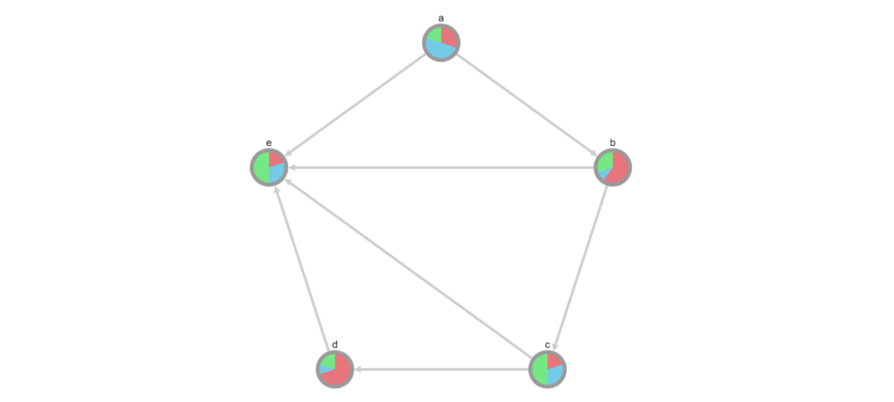

#### usage-preset-animation
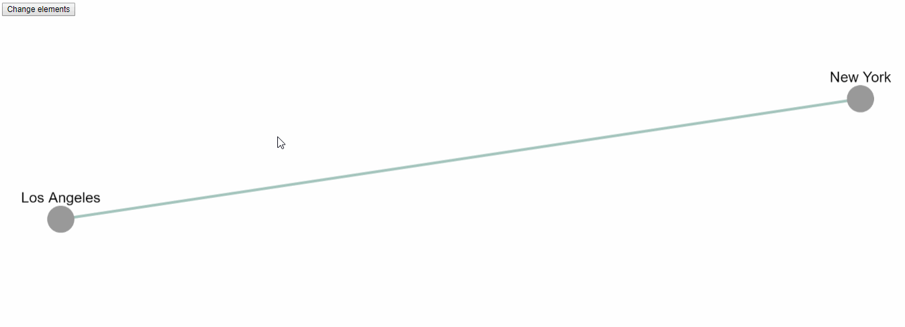

#### usage-remove-selected-nodes
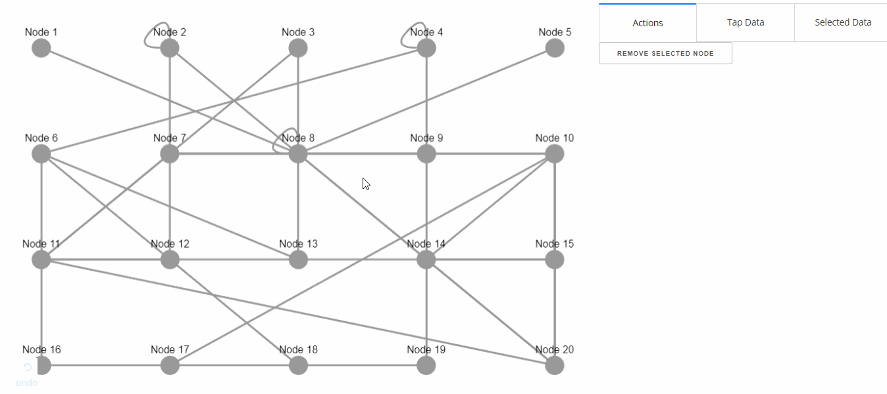

#### usage-reset-button
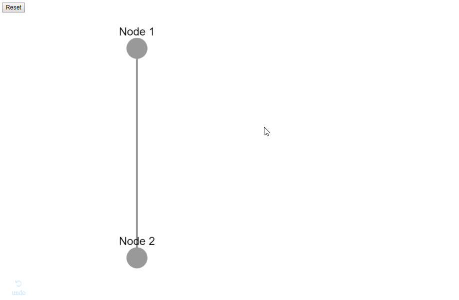

#### usage-visual-style
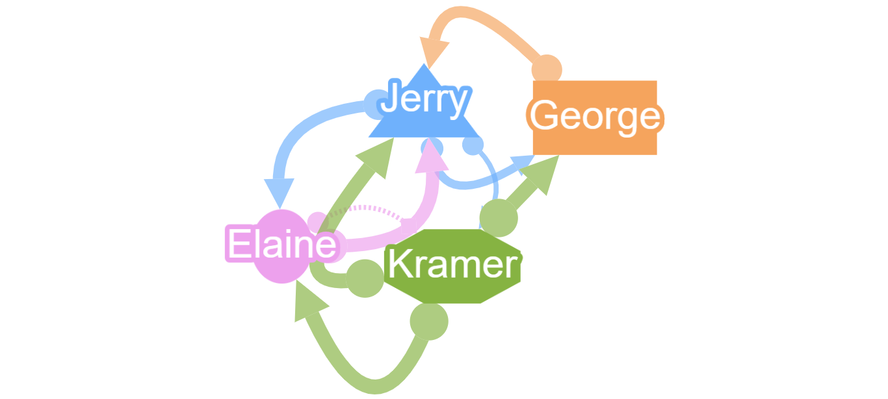

## Data

The phylogeny data was taken from the [Biopython Github Repo](https://github.com/biopython/biopython/blob/master/Tests/PhyloXML/apaf.xml). 

The sample network for social science was taken from the [Google Plus Ego dataset](http://snap.stanford.edu/data/) collected by the SNAP Group at Stanford.

All the other datasets were taken from the [Cytoscape.js Official Documentation Demos](https://github.com/cytoscape/cytoscape.js/tree/master/documentation/demos).

## Demos reproduced from Cytoscape.js

The demos in this folder were all originally written in JavaScript, using the Cytoscape.js library. They were rewritten in Python as extensive example of the Dash Cytoscape API.

To run those demos, please make sure you are in this current directory, and run
```commandline
$ python usage-<example>.py
```

You can find them here: http://js.cytoscape.org/#demos

Please refer to CONTRIBUTING.md for detailed steps about contributing to those examples.

The following are examples working correctly:
* Multiple Instances
* Pie Style
* Visual Style
* Grid Layout
* Circle Layout

The following examples are not fully functional yet and are Work in Progress:
* Cose Layout
* Animated BFS
* Breadthfirst Layout
* Compound Nodes
* Linkout Example
* Labels
* Initialisation
* Edge Types
* Cose Bilkent Layout
* Concentric Layout


The following are examples have not been implemented yet:
* Cola.js gene-gene graph (redundant)
* Tokyo railways
* Wine & cheese
* Performance tuning
* qTip extension
* CoSE Bilkent layout (needs external layout)
* Dagre layout (needs external layout)
* Spread layout (needs external layout)
